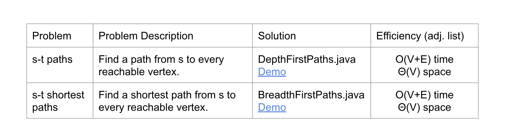

# Graph

# Common Graph Problems

## Graph Representation

Choices are made based on
- Runtime
- Memory usage
- Difficulty of implementing various graph algorithms. 

3 ways to represent graph
- Adjacency Matrix
- Edge Sets (Collection of all edge)
- Adjacency lists (Most common)
  - Efficient when graphs are “sparse” (not too many edges).
  - lc 841. Keys and Rooms
  - 

## Summary

# Reference

[UCB CS61b FA23 Lec23 Graphs 2: DFS, BFS, Implementations](https://docs.google.com/presentation/d/1mHaFA7w9G-wsEPLu-HSpqjm3EYAhDbhrXdcWUJdn4N8/edit#slide=id.g20027df8866_0_858)

