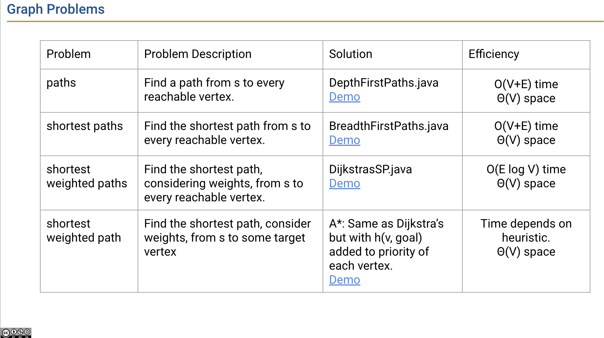
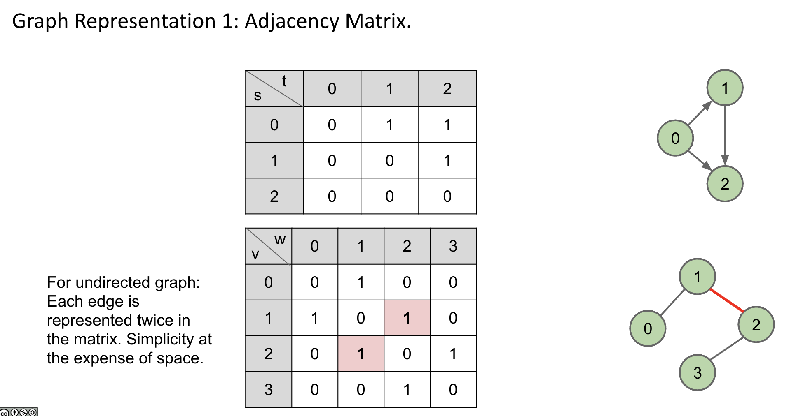
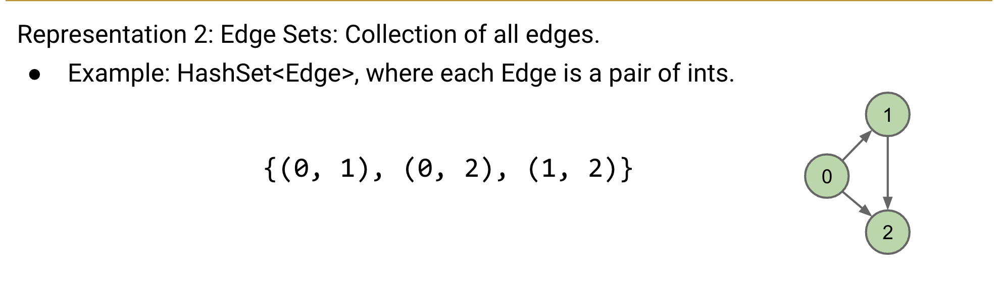
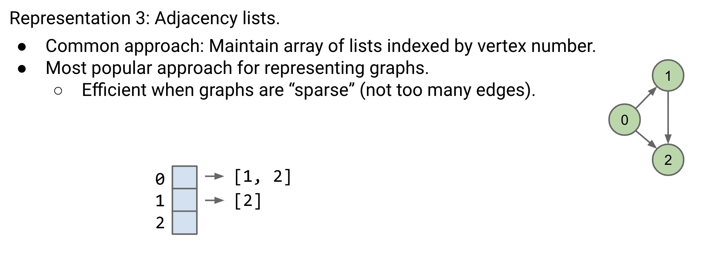
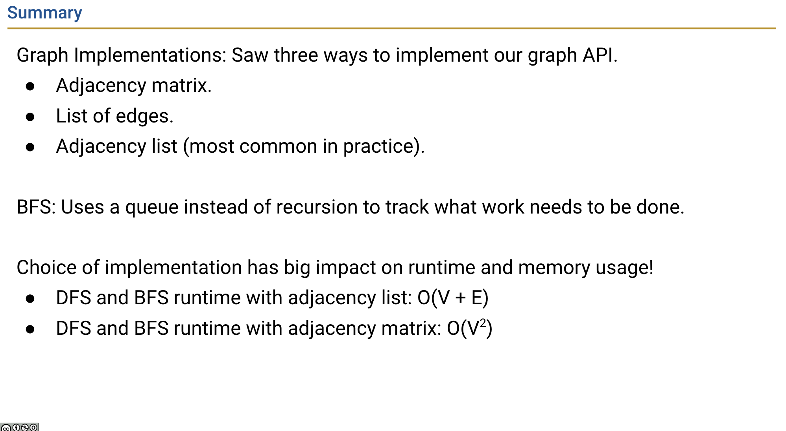

# Graph

## Table of Contents

1. [Common Graph Problems](#common-graph-problems)
  - s-t paths
  - s-t shortest paths using BFS
  - 

2. [Graph Representation](#graph-representation)
   - [Choices based on Runtime, Memory Usage, and Implementation Difficulty](#choices-based-on-runtime-memory-usage-and-implementation-difficulty)
   - [Three Ways to Represent Graphs:](#three-ways-to-represent-graphs)
     - [Adjacency Matrix](#adjacency-matrix)
     - [Edge Sets](#edge-sets)
     - [Adjacency Lists](#adjacency-lists)

3. 

3. [Summary](#summary)

4. [References](#references)

## Common Graph Problems

## Graph Representation

Choices are made based on
- Runtime
- Memory usage
- Difficulty of implementing various graph algorithms. 

3 ways to represent graph
- Adjacency Matrix
- Edge Sets (Collection of all edge)
- Adjacency lists (Most common)
  - Efficient when graphs are “sparse” (not too many edges).
  - lc 841. Keys and Rooms
  - 

## Shortest Paths

## Summary

# Reference

[UCB CS61b FA23 Lec23 Graphs 2: DFS, BFS, Implementations](https://docs.google.com/presentation/d/1mHaFA7w9G-wsEPLu-HSpqjm3EYAhDbhrXdcWUJdn4N8/edit#slide=id.g20027df8866_0_858)  
[UCB CS61b FA23 Lec24 Graphs 3: Shortest Paths](https://docs.google.com/presentation/d/1UHAU4IgEPYO3AJKYANd8XN8VDw5KZlt86HMLm9mJyyY/edit#slide=id.g21c96512b10_0_992)

