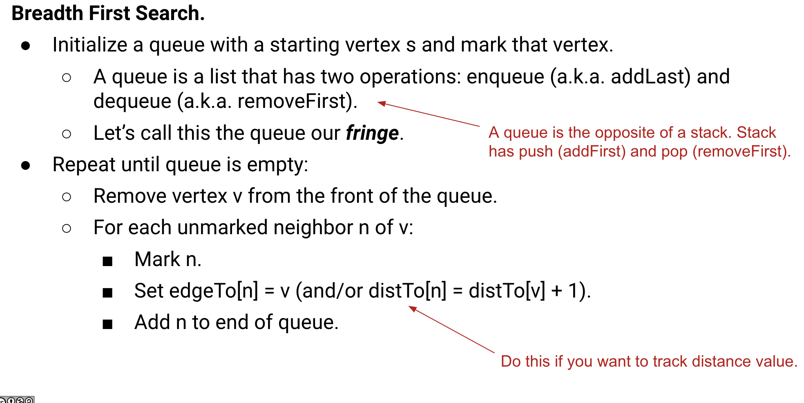

# BFS

## Table of Contents

- [lc 690. Employee Importance](#project-description)
- [lc 130. Surrounded Regions](#project-description)
- [lc 787. Cheapest Flights Within K Stops](#project-description)
- [lc 994](#lc-994)



# Template1 (no need to record distance)

> Using lc 690. Employee Importance to explain the idea

```Python
"""
# Definition for Employee.
class Employee:
    def __init__(self, id: int, importance: int, subordinates: List[int]):
        self.id = id
        self.importance = importance
        self.subordinates = subordinates
"""

class Solution:
    def getImportance(self, employees: List['Employee'], id: int) -> int:
        # graph representation 3: adjancency list
        graph = defaultdict(list)
        for e in employees:
            graph[e.id] = e

        total_importance = 0
        queue = collections.deque()
        queue.append(graph[id])
        # queue
        while queue:
            size = len(queue)
            for _ in range(size):
                cur_e = queue.popleft()
                total_importance += cur_e.importance
                for sub_id in cur_e.subordinates:
                    queue.append(graph[sub_id])

        return total_importance
```

lc 130

```Python
class Solution:
    def solve(self, board: List[List[str]]) -> None:
        """
        Do not return anything, modify board in-place instead.

        Plan
            - for all O on the edge, we do bfs and set these elements to another character, e.g. Y
            - for rest Os, change them to x
            - Change Y back to O
        """
        queue = collections.deque()

        r = len(board)
        c = len(board[0])
        direction = [-1,0,1,0,-1]
        for i in range(r):
            for j in range(c):
                if (i == 0 or i == r - 1 or j == 0 or j == c - 1) and board[i][j] == "O":
                    board[i][j] = "Y"
                    queue.append((i, j))
                    while queue:
                        size = len(queue)
                        for _ in range(size):
                            cur_r, cur_c = queue.pop()
                            for k in range(4):
                                new_r, new_c = direction[k] + cur_r, direction[k + 1] + cur_c
                                if 0 <= new_r < r and 0 <= new_c < c and board[new_r][new_c] == "O":
                                    queue.append((new_r, new_c))
                                    board[new_r][new_c] = "Y"

        for i in range(r):
            for j in range(c):
                if board[i][j] == "O":
                    board[i][j] = "X"
                if board[i][j] == "Y":
                    board[i][j] = "O"
```

# Template2 (need to record distance)

> Using lc 787. Cheapest Flights Within K Stops
> to explain the idea

```Python
class Solution:
    def findCheapestPrice(self, n: int, flights: List[List[int]], src: int, dst: int, k: int) -> int:
        # cheapest price so far
        dist = [float('inf')] * (n + 1)
        dist[src] = 0
        # level at most be k + 1
        level = 0

        # graph representation: using adj list
        graph = defaultdict(list)
        for f in flights:
            graph[f[0]].append((f[1], f[2]))
        queue = collections.deque()
        queue.append((src, 0))
        # queue with the shortest distance
        while queue:
            level += 1
            size = len(queue)
            for _ in range(size):
                cur_city, cur_dist = queue.popleft()
                # iterate through all dst cities of current src cities
                for (dst_city, price) in graph[cur_city]:
                    # if distance is smaller, update it
                    if cur_dist + price < dist[dst_city]:
                        dist[dst_city] = cur_dist + price
                        queue.append((dst_city, cur_dist + price))
            if level == k + 1:
                break

        return dist[dst] if dist[dst] != float('inf') else -1

```

# lc 994

```Python
class Solution:
    def orangesRotting(self, grid: List[List[int]]) -> int:
        m = len(grid)
        n = len(grid[0])
        queue = collections.deque()
        fresh_orange = 0
        for i in range(m):
            for j in range(n):
                if grid[i][j] == 2:
                    queue.append((i, j))
                if grid[i][j] == 1:
                    fresh_orange += 1
        minute = 0
        direction = [-1,0,1,0,-1]
        while queue:
            # 这里用fresh_orange确保
            if fresh_orange == 0:
                break
            minute += 1
            size = len(queue)
            for _ in range(size):
                r, c = queue.popleft()
                for k in range(4):
                    new_r, new_c = direction[k] + r, direction[k + 1] + c
                    if 0 <= new_r < m and 0 <= new_c < n and grid[new_r][new_c] == 1:
                        grid[new_r][new_c] = 2
                        queue.append((new_r, new_c))
                        fresh_orange -= 1

        return minute if fresh_orange == 0 else -1

```
