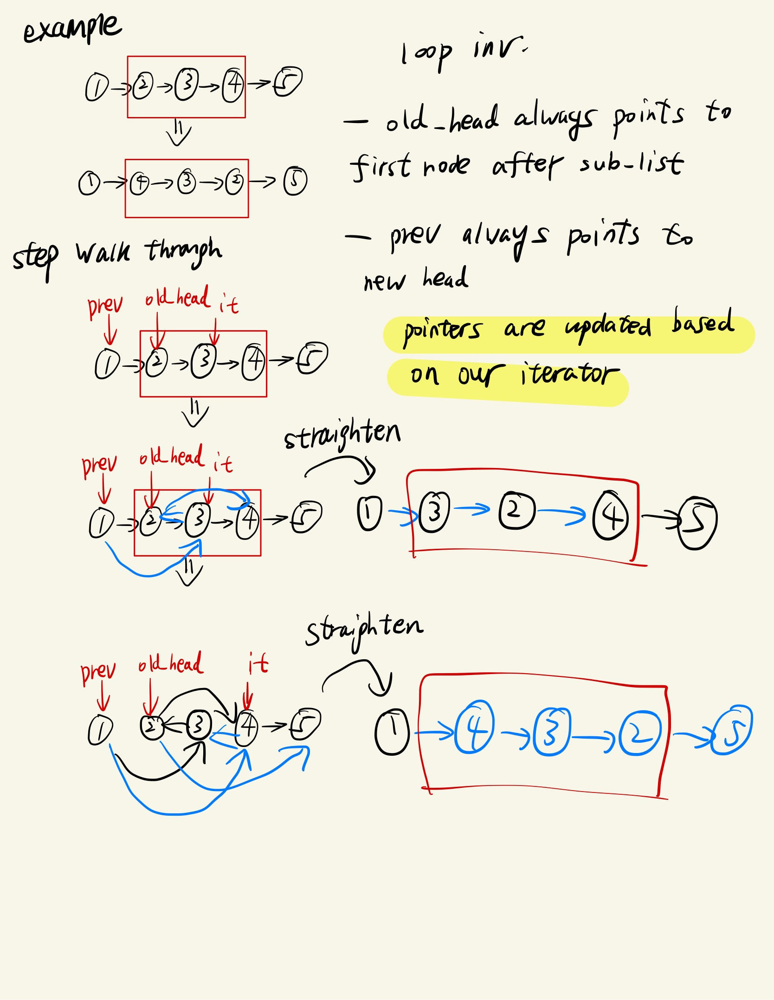

# 一文说明白 linked list 问题

链表的题目几种常见的 pattern

## 找中点问题

## 链表反转问题

链表反转，目前做下来，有 2 种题，1 种是整个链表反转，另 1 种是 sublist 反转

### 整个链表反转

通过一个不变量`new_head`，交替更新当前节点和`new_head`指向的值

### sub linked list 反转

通过 2 个不变量`old_head`和`prev`

- `old_head`总是指向 sub list 之后的第一个节点
- `prev`总是指向 new head

