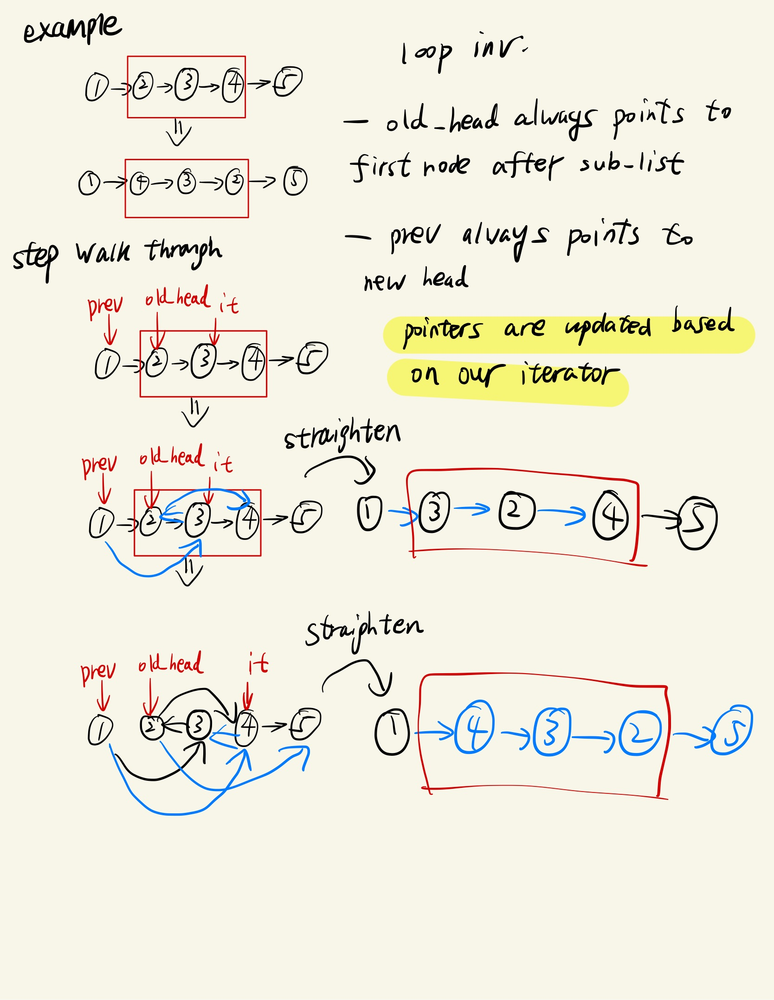

# 一文说明白 linked list 问题

链表的题目几种常见的 pattern

## 找中点问题

- (important) slow 和 fast 从 head 开始而不是 dummy
- 如果是 first middle，condition `while fast and fast.next and fast.next.next`
- 如果是 second middle，condition: `while fast and fast.next`
  - 

## 链表反转问题

链表反转，目前做下来，有 2 种题，1 种是整个链表反转，另 1 种是 sublist 反转

### 整个链表反转

通过一个不变量`new_head`，交替更新当前节点和`new_head`指向的值

> 下面方法不好
> 

用 sublist 的也可以做

### sub linked list 反转

通过 2 个不变量`old_head`和`prev`

- `old_head`总是指向 sub list 之后的第一个节点
- `prev`总是指向 new head

## 简单遍历问题

这是最为常见的一种模式，仅需遍历 1 个或 2 个链表，即可解决。
不过始终记得用 dummy node 避免 edge case

相关题目

- leetcode 2
- lc 21

## 找到第 n 个节点

我们只需用 2 个 pointer，间隔为 n - 1，然后当 fast pointer 走到最后一个节点的时候，slow pointer 的位置就为第 n 个节点

相关题目

- lc 19
