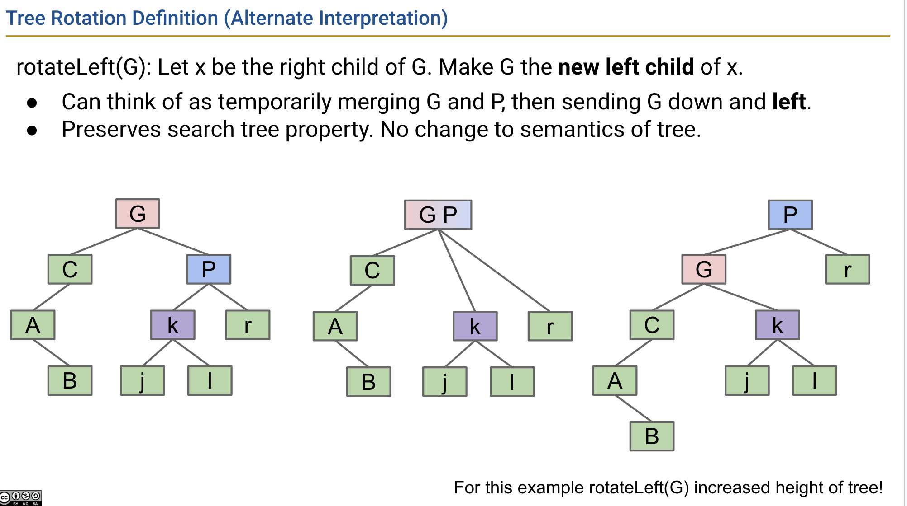
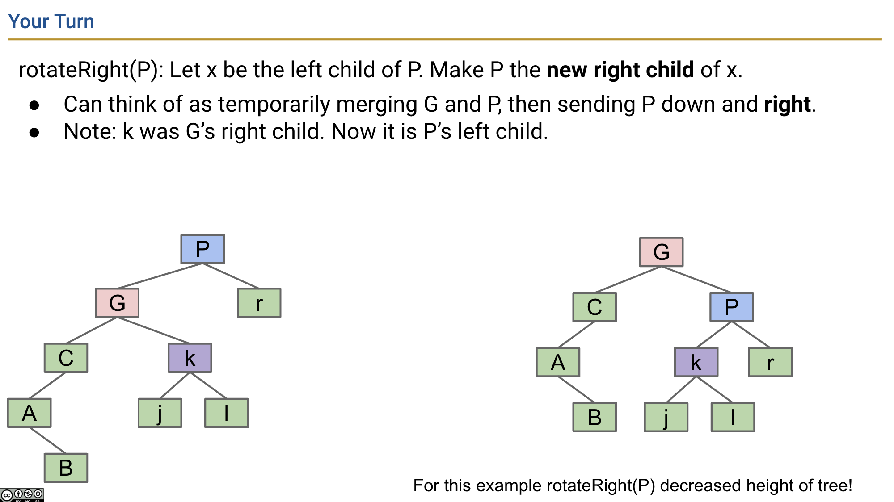

> This folder includes binary search tree and its 2 variants

- binary search tree
- avl tree (balanced bst)
- red-black tree (balanced bst)

# Progression from Binary Tree to Advanced Tree Structures

## 1. Binary Tree

> We know a binary tree is a fundamental data structure. It is a tree structure where each node has 0 to 2 children.

## 2. Binary Search Tree (BST)

> A Binary Search Tree (BST) is a binary tree with the following properties:

- For each node `N`:
  - The value of `N` is greater than the values of all nodes in its left subtree.
  - The value of `N` is less than the values of all nodes in its right subtree.

### Operations of Binary Search Tree

- search(num)
  - O(logn) self-balanced
  - O(n^2) not self-balanced
- insert(num) O(logn)
  - O(logn) self-balanced
  - O(n^2) not self-balanced

## 3. B-Tree

> The problem of BST is it's not self-balanced, which brings some performance issue when the tree is skewed. That's why we bring up B-Tree which is just a self-balanced binary search tree

- B-trees of order L=3 (like we used today) are also called a 2-3-4 tree or a 2-4 tree.
  “2-3-4” refers to the number of children that a node can have, e.g. a 2-3-4 tree node may have 2, 3, or 4 children.
- B-trees of order L=2 are also called a 2-3 tree.

> real-world usage

File System:

- BTRFS

## 4. Red-Black Tree

> B-Tree is good, but it's hard to implement, so that's why we have red-black tree (LLRB)

> LLRB in one sentence

- When we insert nodes, inserted nodes are red. By maintaining some properties (invariants) relevant to red and black, we achieve the goal that the tree is always balanced

### Invariants

> Actually we just do the same insertion as how we do in BST, but we also need to make sure it meets `LLRB properties`

> Where do we get these invariants?
> we derive these operations based on the fact that there is a one-to-one correspondence of valid LLRB to 2-3 trees

> why the new inserted node is red?

In 2-3 trees new values are ALWAYS added to a leaf node (at first). [cs61b fa23 lec18 slide49](https://docs.google.com/presentation/d/1GP_5y1hpfF7SfUz4rfwcP7uXIYZ4cNRREFyz6IDfWhg/edit?pli=1#slide=id.g5240c8ba42_0_564)

Invariants:

- Root node is black
- If a node has one red child, it must be on the left
- No node can have two red children
- No red node can have a red parent (every red node’s parent is black)
  - Two consecutive left-leaning red nodes.
  - Red node with a right-leaning red child/node

> real-world usage

File System:

- EXT

### Operations to keep balance

> There are 2 kinds of operations we introduce here on the top of a binary search tree

- rotation operation
- color flip
- Also we changed insert a little bit

#### Rotation

- rotateLeft(G)
  - Let x be the right child of G. Make G the new left child of x.
  - Can think of as temporarily merging G and P, then sending G down and left.
  - The two nodes **swap** colors so that the new root is the same color as the old root.
  - **new node's left child now becomes the right child of old node** see `node k` here
  - 
- rotateRight(P)
  - Let x be the left child of P. Make P the new right child of x.
  - The two nodes **swap** colors so that the new root is the same color as the old root.
  - **new node(G)'s right child(k) now becomes the left child of old node(P)** see `node k` here
  - 

#### Color Flip

- flip colors or node and its 2 children

#### Videos

a good video given by inventor of red-black tree:  
https://www.coursera.org/lecture/algorithms-part1/red-black-bsts-GZe13

cs61b lab8:LLRB  
https://fa23.datastructur.es/materials/lab/lab08/

#### Summary

- when doing insertion, we need to make sure the subtree rooted as current tree doesn't violate LLRB invariant
- We have 3 tools to help us
  - rotateLeft
  - rotateRight
  - flipColors

_That's it_

# References

This repo makes use of slides from the CS61B course. Special thanks to the authors and instructors for providing these valuable resources.

- CS61B: Data Structures, by Josh Hug. Available at: [CS61B Course Materials](https://fa23.datastructur.es/)
