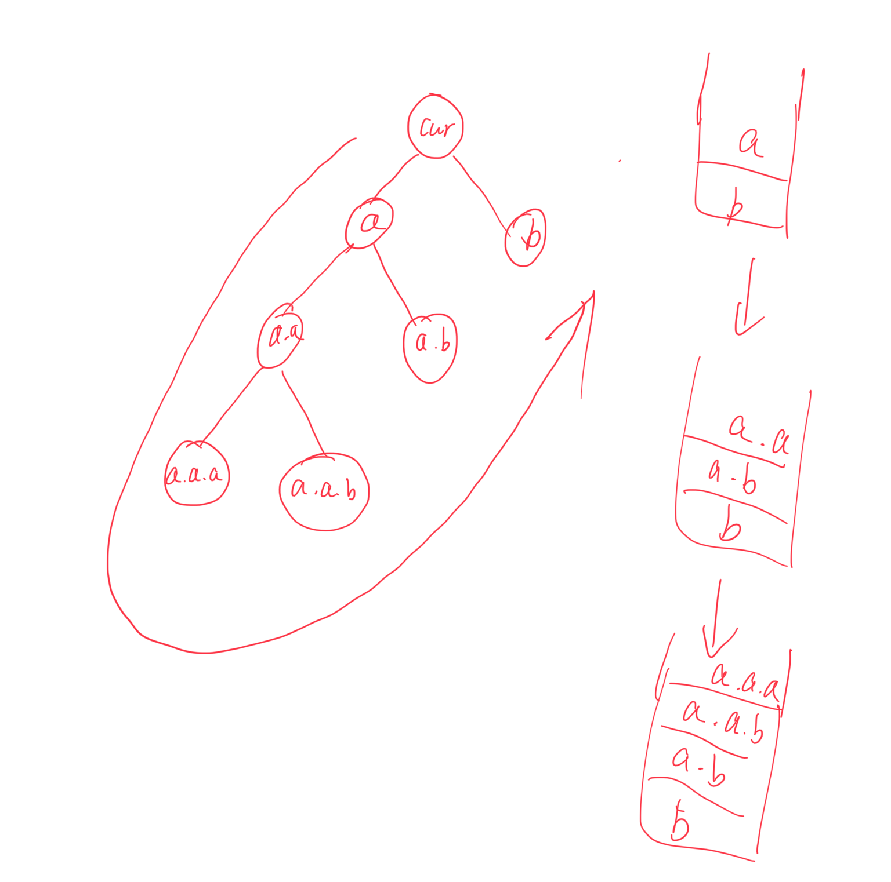

# Tree 的故事

Tree 比较常见的

- binary tree
- binary search tree
- red black tree

对于 leetcode tree 的问题，通常比较常见的 pattern

- traversal

虽然我们有 in, pre, post, level order 遍历

但其实 level order 的本质就是 bfs，其他的本质是 dfs

tree 问题最大的特性，考点就是它的 recursive 的特性，一个 tree 的 children 本身又是 tree。所以 tree 问题特别能考察对于理解 recursion 的理解

recursion 和 traversal 的区别就是

- recursion 考虑的是如何把一个 tree 分解成 subtree
- traversal 则是通过遍历一遍 tree，就能找到答案
  - traversal 可以通过递归的 recursion 的方式来做

区分两者我觉得最直接的方法就是，traversal 遍历的问题，可以通过 iteration 解决。
而分解的问题，最直接的方法是通过 recursion 解决。但两者不冲突，一道题可以从 2 种思维方式解决

而对于重复的子问题，就可以用 dp，memo 来优化了，但问题本质还是穷举所有的可能性

## traversal 写法

> 对于 3 种 traversal，我们既可以用 recursion 也可以用 iteration

recursion 非常的直观

```Python
def traverse(node):
  if not node:
    return
  # part 1
  traverse(node.left) # part 2
  # part 3
  traverse(node.right) # part 4
  # part 5 （和part1 node.val是一样的，只是位置不同）
```

iteration，可以把 preorder 和 postorder 分成一类

对于一个 fun call 如下（和上面 traverse 一样）

```Python
def func(cur):
  func(a)
  func(b)

func(cur)
```

preorder 的执行顺序是
cur -> a -> a.a -> a.a.a -> a.a.b -> a.b -> b

这如果用 stack 表示，先进后出
如果我们要确保 pop 的顺序是`a -> a.a -> a.a.a -> a.a.b -> a.b -> b`

其实可以发现，我们只需保证 每一层的 b 在 a 前进 stack 即可。因此我们做一个 dry run

```
it1
stack = [b, a]
it2
pop() => a
stack = [b, a.b, a.a]
it3
pop() => a.a
stack = [b, a.b, a.a.b, a.a.a]
it4
pop() => a.a.a
stack = [b, a.b, a.a.b]
it5
pop() => a.a.b
stack = [b, a.b]
it6
pop() => a.b
stack = [b]
it7
pop() => b
stack = []
```



> 总结：用 stack 模拟 fun recursion，其实需要做的是手动保存当前 level 的信息。stack append 顺序和 recursive function 的顺序相反

### 如何用 preorder 推 postorder

- step1：根据下面，我们知道，preorder 的访问顺序是 part1 -> part2 -> part4

```Python
def traverse(node):
  if not node:
    return
  # part 1
  traverse(node.left) # part 2
  # part 3
  traverse(node.right) # part 4
  # part 5 （和part1 node.val是一样的，只是位置不同）
```

- step2: 在上面我们已经成功归纳了如何用手动 stack 表示 fun call stack。因此 iteration 的 preorder 为

```Python
    def preorderTraversal(self, root: Optional[TreeNode]) -> List[int]:
        if not root:
            return root

        stack = [root]
        res = []
        while stack:
            cur = stack.pop()
            res.append(cur.val)
            if cur.right:
                stack.append(cur.right)
            if cur.left:
                stack.append(cur.left)

        return res
```

- step3: 如果根据 recursion 的`traverse`，我们可以得出 postorder 的访问顺序是 part2 -> part4 -> part5。part5 其实就是 part1，所以即为 part2->part4->part1。如果能按照 part1->part4->part2 访问，然后 reverse 最后 list 的顺序，即为 postorder。而 part4 和 part2 交换顺序仅需交换进入 stack 的顺序即可。因此我们可以得到如下的代码

```Python
    def postorderTraversal(self, root: Optional[TreeNode]) -> List[int]:
        if not root:
            return root

        stack = [root]
        res = []
        while stack:
            cur = stack.pop()
            res.append(cur.val)
            if cur.left:
                stack.append(cur.left)
            if cur.right:
                stack.append(cur.right)

        return res[::-1]
```

inorder

```Python
    def inorderTraversal(self, root: Optional[TreeNode]) -> List[int]:
        stack = []
        cur = root
        res = []
        while cur or stack:
            while cur:
                stack.append(cur)
                cur = cur.left
            cur = stack.pop()
            res.append(cur.val)
            cur = cur.right
        return res
```

### in, pre, post 的 iteration 统一写法

其实根据下面的函数以及上面的总结，我们知道 stack 模拟 func call stack 只是顺序颠倒一下。所以我们其实可以把所有写法都统一

```Python
def traverse(node):
  if not node:
    return
  # part 1
  traverse(node.left) # part 2
  # part 3
  traverse(node.right) # part 4
  # part 5 （和part1 node.val是一样的，只是位置不同）
```

> 统一的框架

```Python
if not root:
    return []

stack = [root]
res = []
while stack:
    # 这里我们pop出来的东西是按照我们之前stack.append的顺序排列的
    cur = stack.pop()
    # 这里我们判断cur的类型，可以找到我们的值，加入到result中
    if isinstance(cur, int):
        res.append(cur)
        continue

    # part5 operation的位置, postorder 这里stack.append(cur.val)
    if cur.right:
        stack.append(cur.right) # part 4
    # part 3: inorder 这里stack.append(cur.val)
    if cur.left:
        stack.append(cur.left) # part 2
    # part 1: preorder 这里stack.append(cur.val)
```

preorder : 124，转换为 iteration stack: 421，遍历到 part1 我们希望 res.append(cur,val)  
inorder: 234，转换为 iteration stack: 432，遍历到 part3 我们希望 res.append(cur.val)  
postorder: 245，转换为 iteration stack: 542，遍历到 part5，我们希望 res.append(cur.val)

## 题型分析

> recursion 通过分解思维可以解决的相关题目

- 95. Unique Binary Search Trees II
- 100. Same Tree
- 101. Symmetric Tree
- 104. Maximum Depth of Binary Tree
- 105. Construct Binary Tree from Preorder and Inorder
- 106. Construct Binary Tree from Inorder and Postorder Traversal
  - 需要借助 hash table 维护 index
- 108. Convert Sorted Array to Binary Search Tree
- 109. Convert Sorted List to Binary Search Tree
- 110. Balanced Binary Tree

> traversal + 维护 global 变量

- 124. Binary Tree Maximum Path Sum
- 543. Diameter of Binary Tree
- 5. Longest Palindromic Substring
- 300. Longest Increasing Subsequence

> BFS

- 102. Binary Tree Level Order Traversal
- 103. Binary Tree Zigzag Level Order Traversal
- 107. Binary Tree Level Order Traversal II

> vertical traversal

- [lc 314. 314. Binary Tree Vertical Order Traversal](https://leetcode.com/problems/binary-tree-vertical-order-traversal/description/?envType=company&envId=facebook&favoriteSlug=facebook-three-months)
- [lc 987. Vertical Order Traversal of a Binary Tree](https://leetcode.com/problems/vertical-order-traversal-of-a-binary-tree/)
